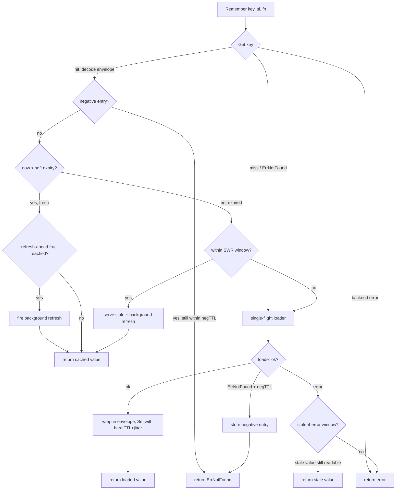
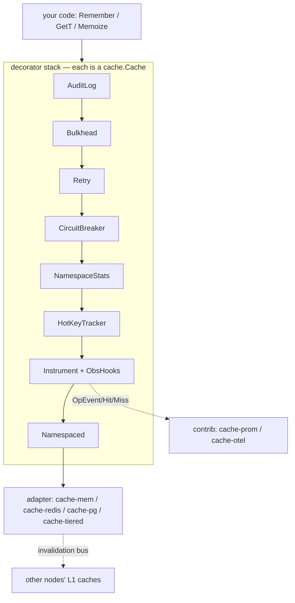
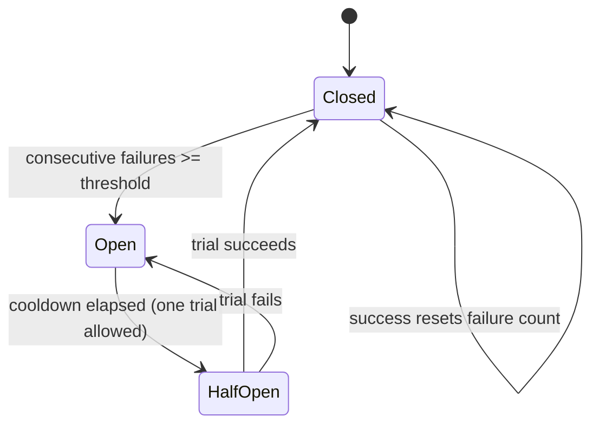

# ubgo/cache

**A production-grade caching library for Go: one `Cache` interface for in-memory, Redis, Postgres and distributed/tiered backends, with typed generics, a single-flight `Remember` (TTL, refresh-ahead, stale-while-revalidate, stale-if-error, negative caching, jitter), LRU/W-TinyLFU-capable adapters, a portable distributed lock, and a shared conformance suite.**

`ubgo/cache` is the bytes-level cache contract plus the ergonomics layered on top of it. Write your code against one interface and swap an in-memory LRU for Redis or a multi-tier L1/L2 cache without touching call sites. The core module has **zero third-party dependencies** — observability and extra codecs ship as separate opt-in `contrib/` modules so your dependency graph stays empty unless you ask for more.

## Why

Most Go caching is either a bare `map[string][]byte` (no TTL, no single-flight, no metrics) or tightly coupled to one backend (Redis-only, in-process-only). Real services need: load-through with stampede protection, graceful degradation when the backend is down, multi-tenant key isolation, per-namespace hit-rate visibility, and the freedom to change backends. `ubgo/cache` gives you all of that behind a single interface, with every backend validated by the same conformance suite so behavior is identical no matter what you plug in.

## Features

- **One interface, every backend** — `Cache` is bytes-in/bytes-out; adapters for in-memory, Redis, Postgres/SQLite, tiered, and Memcached.
- **Typed generics** — `Remember[T]`, `GetT[T]`, `SetT[T]`, `Typed[T]`, `RememberMulti[T]`, `Warm[T]`, `Memoize` — no manual (de)serialization at call sites.
- **Single-flight `Remember`** — concurrent misses for the same key collapse to one loader call.
- **Cache patterns built in** — refresh-ahead, stale-while-revalidate (SWR), stale-if-error, negative caching, TTL jitter.
- **Pluggable codecs** — JSON, gob, raw; `EncryptedCodec` (AES-GCM) for caching PII/secrets in shared stores; msgpack/zstd/protobuf in `contrib/`.
- **Namespace isolation** — `Namespaced` prefixes keys so many services share one backend safely.
- **Portable distributed lock** — `Locker` built on `SetNX`, works on any adapter with no backend-specific code.
- **Cross-process invalidation** — best-effort fan-out bus so L1 caches drop stale copies.
- **Resilience decorators** — circuit breaker, retry with backoff, bulkhead (concurrency limit).
- **Observability** — zero-dependency hooks (`Instrument`/`ObsHooks`), per-namespace stats, hot-key detection (Space-Saving), audit log, an admin HTTP endpoint.
- **Conformance suite** — `cachetest.Run` + a correct in-memory `Mock` + a Zipfian/hit-rate harness for tuning eviction policies.

## Backends

| Module | Backend |
|---|---|
| [`cache-mem`](https://github.com/ubgo/cache-mem) | in-memory, sharded — Adaptive W-TinyLFU (default) or LRU; snapshot + periodic checkpoint |
| [`cache-redis`](https://github.com/ubgo/cache-redis) | Redis 6+ (+ Pub/Sub invalidation) |
| [`cache-pg`](https://github.com/ubgo/cache-pg) | Postgres 14+ / SQLite (portable `database/sql`) |
| [`cache-tiered`](https://github.com/ubgo/cache-tiered) | L1/L2(/L3) composer with read-promotion + cross-process invalidation |
| [`cache-memcached`](https://github.com/ubgo/cache-memcached) | Memcached (partial — protocol-limited) |
| [`cache-cluster`](https://github.com/ubgo/cache-cluster) | client-side sharding across nodes |
| [`cache-cli`](https://github.com/ubgo/cache-cli) | inspector binary |

**contrib/** (this repo, separate modules so the core stays dependency-free)

| Module | Purpose |
|---|---|
| `contrib/cache-prom` · `contrib/cache-otel` | Prometheus / OpenTelemetry exporters |
| `contrib/codec-msgpack` · `contrib/codec-zstd` · `contrib/codec-protobuf` | extra codecs |

## Install

```sh
go get github.com/ubgo/cache
go get github.com/ubgo/cache-mem   # or cache-redis, cache-pg, cache-tiered, ...
```

Requires Go 1.24+.

New here? The **[feature cookbook in `docs/`](./docs/README.md)** documents every exported feature one-by-one with real-world use cases and runnable snippets.

## Quick start

```go
c := memcache.New(memcache.WithMaxEntries(100_000))
defer c.Close()

// Bytes in, bytes out. Get returns (nil, cache.ErrNotFound) on miss — never (nil, nil).
_ = c.Set(ctx, "k", []byte("v"), time.Minute)
b, err := c.Get(ctx, "k")

// Typed load-through with stampede protection and the differentiator options:
u, err := cache.Remember(ctx, c, "user:42", 5*time.Minute,
    func(ctx context.Context) (User, error) { return db.LoadUser(ctx, 42) },
    cache.WithJitter(0.1),                 // spread expiry across a batch of keys
    cache.WithStaleIfError(time.Minute),   // serve last-good if the loader fails
    cache.WithRefreshAhead(0.8),           // refresh hot keys before they expire
)

// Multi-tenant isolation:
tenant := cache.Namespaced(c, "tenant:42")

// Portable distributed lock (works on any backend):
l := cache.NewLock(c, "cron:nightly", 30*time.Second)
if err := l.Acquire(ctx); err == nil {
    defer l.Release(ctx)
    // ... only one holder runs this ...
}
```

## How `Remember` decides



The single-flight box means: 30 goroutines that all miss `user:42` at once run the loader **exactly once**; the other 29 block and share the result.

## Architecture & decorator composition

Every decorator both *is* a `cache.Cache` and *wraps* one, so they stack arbitrarily. The outermost wrapper sees the call first.



```go
c := cache.NewAuditLog(
        cache.NewBulkhead(
            cache.NewRetry(
                cache.NewCircuitBreaker(rediscache.New(rdb)),
            ), 256),
        auditSink)
```

---

## Usage

### The `Cache` interface and its semantics

`Cache` is the bytes-level contract every backend implements. It is intentionally untyped; typed ergonomics live in the generics layer.

```go
type Cache interface {
    Get(ctx, key) ([]byte, error)
    GetMulti(ctx, keys) (map[string][]byte, error)
    Has(ctx, key) (bool, error)
    TTL(ctx, key) (time.Duration, error)
    Set(ctx, key, val, ttl) error
    SetMulti(ctx, items map[string]Item) error
    SetNX(ctx, key, val, ttl) (bool, error)
    Expire(ctx, key, ttl) error
    Touch(ctx, key) error
    Incr(ctx, key, delta) (int64, error)
    Decr(ctx, key, delta) (int64, error)
    Del(ctx, keys ...string) error
    DeleteByPrefix(ctx, prefix) error
    Flush(ctx) error
    Iterate(ctx, IterateOpts) Iterator
    Ping(ctx) error
    Close() error
    Stats() Stats
}
```

**Semantics every adapter MUST honor** (enforced by `cachetest.Run`):

- `Get` returns `(nil, ErrNotFound)` on miss or expiry — **never** `(nil, nil)`.
- `ttl <= 0` means **no expiry** (lives until evicted or explicitly deleted).
- `SetNX` returns `(true, nil)` **only** when it created the key.
- `Incr`/`Decr` are atomic; a missing key is treated as `0`.
- Optional ops an adapter cannot serve return `ErrUnsupported`.
- `Close` is idempotent; ops after `Close` return `ErrClosed`.

Iteration is a forward-only cursor — always `Close` it:

```go
it := c.Iterate(ctx, cache.IterateOpts{Prefix: "user:"})
defer it.Close()
for it.Next() {
    k, v := it.Key(), it.Value()
}
if err := it.Err(); err != nil { /* ErrUnsupported on non-scanning backends */ }
```

### Errors

Adapters return these sentinels (wrapped with `%w` is fine) so callers `errors.Is` regardless of backend:

| Error | Meaning |
|---|---|
| `ErrNotFound` | key absent or expired |
| `ErrUnsupported` | optional op not implemented by this adapter |
| `ErrSerialization` | codec encode/decode failure (incl. tampered ciphertext) |
| `ErrTimeout` | op exceeded its deadline (adapter-surfaced) |
| `ErrCircuitOpen` | resilience breaker is open |
| `ErrTooLarge` / `ErrKeyTooLong` | value/key exceeds adapter limits |
| `ErrClosed` | op invoked after `Close` |
| `ErrLockNotAcquired` | `Locker.Acquire` failed (already held) |
| `ErrInFlight` | `Once` lease held by another caller, no result yet |

```go
v, err := c.Get(ctx, "user:42")
if errors.Is(err, cache.ErrNotFound) {
    // cache miss — load it
}
```

### Codecs

```go
type Codec interface {
    Encode(v any) ([]byte, error)
    Decode(data []byte, v any) error
    Name() string
}
```

Built in: `JSONCodec{}` (default — portable, debuggable), `GobCodec{}` (fast Go-only struct round-trips), `RawCodec{}` (passthrough for `[]byte`/`string`; anything else is a loud `ErrSerialization` rather than silent corruption). `DefaultCodec` is JSON. Extra codecs (`contrib/codec-msgpack`, `-zstd`, `-protobuf`) are separate modules.

```go
u, err := cache.Remember(ctx, c, "user:42", time.Minute, loadUser,
    cache.WithCodec(cache.GobCodec{}))
```

### EncryptedCodec (cache PII/secrets safely)

Wraps any codec with authenticated AES-GCM encryption. A raw dump of the store is not a data breach; tampered ciphertext fails to decrypt and surfaces as `ErrSerialization`.

```go
codec := cache.EncryptedCodec{
    Inner: cache.JSONCodec{},
    Key:   cache.StaticKey(key32), // 16/24/32-byte AES key
}
_ = cache.SetT(ctx, c, "ssn:42", ssn, time.Hour, cache.WithCodec(codec))
```

Wire format: `[12-byte random nonce][GCM ciphertext+tag]`. `KeyProvider` may return a fresh key each call to support rotation (rotate by re-warming, not in place).

### Namespaced (multi-tenant / multi-service isolation)

```go
billing := cache.Namespaced(redis, "svc:billing") // keys -> "svc:billing:..."
search  := cache.Namespaced(redis, "svc:search")
```

`Flush` on a namespaced view scopes to the prefix via `DeleteByPrefix` instead of wiping the whole backend. Iteration keys are returned unprefixed.

### Remember and all its options

`Remember[T]` is the workhorse: return the cached value, or single-flight `fn` on miss and store it. It composes:

| Option | Effect |
|---|---|
| `WithCodec(c)` | override the value codec |
| `WithRefreshAhead(frac)` | once `frac` (0–1) of the TTL has elapsed, refresh in the background and return the still-valid value immediately — a hot key never expires under load |
| `WithStaleWhileRevalidate(d)` | after hard expiry, keep serving the stale value for `d` while one background load refreshes |
| `WithStaleIfError(d)` | serve the stale value for `d` past expiry **only if the loader errors** — trades staleness for availability |
| `WithNegativeTTL(d)` | cache a loader's `ErrNotFound` for `d` so a missing key doesn't re-run an expensive lookup every request |
| `WithJitter(frac)` | apply ±`frac` random noise to the stored TTL so a batch written together doesn't all expire at once (thundering herd) |

```go
p, err := cache.Remember(ctx, c, "product:99", 10*time.Minute,
    func(ctx context.Context) (Product, error) { return db.Product(ctx, 99) },
    cache.WithRefreshAhead(0.8),
    cache.WithStaleWhileRevalidate(30*time.Second),
    cache.WithStaleIfError(2*time.Minute),
    cache.WithNegativeTTL(15*time.Second),
    cache.WithJitter(0.1),
)
```

`Remember` stores values inside a small JSON **envelope** (born/soft-expiry/missing) so the staleness metadata survives any value codec. The backend's physical TTL is the soft TTL plus the widest stale window.

### GetT / SetT / Typed

```go
_ = cache.SetT(ctx, c, "cfg", cfg, time.Hour)        // plain codec, no envelope
v, err := cache.GetT[Config](ctx, c, "cfg")          // ErrNotFound on miss

users := cache.NewTyped[User](c, cache.WithJitter(0.1))
u, err := users.Remember(ctx, "user:42", time.Minute, loadUser)
_ = users.Set(ctx, "user:42", u, time.Minute)
raw := users.Raw()                                   // underlying bytes Cache
```

`GetT` transparently reads both `SetT` (plain) and `Remember` (envelope) payloads.

### Memoize / QueryKey / Once

```go
// Memoize: cache-backed single-flight memoization of a pure-ish function.
getUser := cache.Memoize(c, "user", time.Minute,
    func(ctx context.Context, id int) (User, error) { return db.User(ctx, id) },
    func(id int) string { return strconv.Itoa(id) })
u, err := getUser(ctx, 42) // DB hit once; concurrent calls collapse to one

// QueryKey: deterministic, collision-resistant key from name + parts
// (length-prefixed so ("a","bc") and ("ab","c") never collide).
key := cache.QueryKey("users.byOrg", orgID, page, sort)

// Once: run fn at most once per idempotency key; cache its result for ttl.
// Duplicate webhook / double-clicked payment returns the original result.
res, err := cache.Once(ctx, c, "pay:"+reqID, time.Hour, chargeCard)
if errors.Is(err, cache.ErrInFlight) { /* another caller is mid-flight */ }
```

### RememberMulti / Warm (batch & preload)

```go
// RememberMulti: collapse the N+1 (loop calling Remember) into 2 round-trips —
// one GetMulti, one batched loader call for all misses, one SetMulti.
users, err := cache.RememberMulti(ctx, c, ids, time.Minute,
    func(ctx context.Context, miss []string) (map[string]User, error) {
        return db.UsersByIDs(ctx, miss) // one query for all misses
    })

// Warm: preload hot keys before traffic (startup / post-deploy) with bounded
// concurrency. A per-key failure is reported, not fatal; honors ctx cancel.
res := cache.Warm(ctx, c, hotIDs, 5*time.Minute, 16,
    func(ctx context.Context, id string) (Product, error) { return db.Product(ctx, id) })
for _, r := range res { if r.Err != nil { log.Printf("warm %s: %v", r.Key, r.Err) } }
```

### Locker (portable distributed lock)

```go
l := cache.NewLock(redis, "cron:nightly-billing", 30*time.Second)
if err := l.Acquire(ctx); err != nil { return } // another pod owns it
defer l.Release(ctx)
// long job: extend the lease so it doesn't expire mid-run
_ = l.Refresh(ctx)
```

Each lock carries a random token; `Refresh`/`Release` only act if the token still matches, so you cannot release a lease that already expired and was re-taken. Use a short TTL + periodic `Refresh` for long critical sections.

### Invalidation (cross-process cache busting)

```go
bus := cache.NewInProcInvalidation() // reference impl; cache-redis ships a Pub/Sub one
go bus.Subscribe(ctx, func(key string) {
    if key == cache.InvalidateAll { l1.Flush(ctx); return }
    l1.Del(ctx, key)
})
_ = bus.Publish(ctx, "user:42")            // drop this key everywhere
_ = bus.Publish(ctx, cache.InvalidateAll)  // drop everything
```

Delivery is best-effort: a missed message only means a stale L1 entry until its own (short) TTL elapses.

### Instrument / ObsHooks (observability)

```go
c = cache.Instrument(c, cache.ObsHooks{
    Adapter: "redis", Namespace: "billing",
    OnOp:   func(ev cache.OpEvent) { metrics.Observe(ev.Op, ev.Duration, ev.Err) },
    OnHit:  func(keyHash string) { hits.Inc() },
    OnMiss: func(keyHash string) { misses.Inc() },
})
```

Raw keys may contain PII, so events carry `KeyHash` (first 8 bytes of sha256, hex) — never the key. The core is dependency-free; `contrib/cache-prom` and `contrib/cache-otel` implement these hooks for Prometheus/OpenTelemetry.

### HotKeyTracker (find the key that's 60% of your traffic)

```go
hk := cache.NewHotKeyTracker(c, 100) // Space-Saving: O(1)/op, bounded memory
c = hk
for _, kc := range hk.Top(10) { log.Printf("%s ~%d", kc.Key, kc.Est) }
hk.Reset() // e.g. per sampling window
```

Counts are approximate (Space-Saving over-estimates by at most the evicted minimum); the *ranking* of genuinely hot keys is reliable.

### NamespaceStats (per-feature hit rates)

```go
ns := cache.NewNamespaceStats(c, nil) // default: bucket by prefix before ':'
c = ns
for name, s := range ns.ByNamespace() {
    log.Printf("%s hit-rate %.2f", name, s.HitRatio())
}
```

A great *global* hit rate can hide one broken feature; bucketing surfaces it for one map lookup per op.

### CircuitBreaker / Retry / Bulkhead (resilience)

```go
c = cache.NewCircuitBreaker(c,
    cache.WithBreakerThreshold(5),          // consecutive failures to open
    cache.WithBreakerCooldown(5*time.Second))
c = cache.NewRetry(c,
    cache.WithRetryAttempts(3),
    cache.WithRetryBackoff(20*time.Millisecond)) // attempt i waits base*2^(i-1)
c = cache.NewBulkhead(c, 256)               // max in-flight ops; rest block on ctx
```

`ErrNotFound`/`ErrUnsupported`/`ErrCircuitOpen` are normal outcomes — they never trip the breaker or trigger a retry. After the cooldown the breaker allows one half-open trial request that decides whether to close again.



### AuditLog (compliance trail for mutations)

```go
c = cache.NewAuditLog(c, func(ev cache.AuditEvent) {
    log.Printf("%s %v err=%v at=%s", ev.Op, ev.Keys, ev.Err, ev.At)
})
```

Every state-changing op (`Set`/`SetMulti`/`SetNX`/`Expire`/`Touch`/`Incr`/`Decr`/`Del`/`DeleteByPrefix`/`Flush`) emits an event. Audit events intentionally include **raw keys** — route them to a trusted sink. Reads are not audited.

### admin (HTTP inspection endpoint)

```go
mux := http.NewServeMux()
admin.Mount(mux, c, admin.Options{
    Prefix: "/cache",
    Authorized: func(r *http.Request) bool {
        return r.Header.Get("X-Admin-Token") == os.Getenv("ADMIN_TOKEN")
    },
})
```

| Route | Behavior |
|---|---|
| `GET /cache/stats` | JSON `cache.Stats` + hit ratio |
| `GET /cache/key?key=foo` | `{found, ttl_ms, bytes}`; add `&value=1` for base64 value |
| `POST /cache/evict?key=foo` | delete one key — refused (403) unless `Authorized` returns true |

The value is omitted unless explicitly requested (PII), and evict is forbidden by default (`Authorized` nil ⇒ always 403). Imports only `net/http` + `encoding/json`.

### cachetest (conformance, mock, hit-rate harness)

Every adapter is validated by the same suite — behavior is identical across backends:

```go
func TestConformance(t *testing.T) {
    cachetest.Run(t, func(t *testing.T) cache.Cache { return memcache.New() })
}

func BenchmarkAdapter(b *testing.B) {
    cachetest.Bench(b, func(b *testing.B) cache.Cache { return memcache.New() })
}
```

`cachetest.NewMock()` is a correct, dependency-free in-memory `cache.Cache` for your own unit tests, with failure injection via `FailOn` (`mock.FailOn = map[string]error{"get": io.ErrUnexpectedEOF}`). It passes the conformance suite, so it doubles as the reference implementation.

Tune eviction policies with the Zipfian/scan harness:

```go
z := cachetest.NewZipfian(100_000, 1.07, 42)         // realistic skewed traffic
hr := cachetest.HitRate(memcache.New(), z.Key, 1_000_000)
log.Printf("hit rate %.4f", cachetest.Round(hr))

scan := cachetest.ScanGen(1000, 10, 42)              // hot set + scan flood (kills naive LRU)
hr = cachetest.HitRate(memcache.New(), scan, 500_000)
```

---

## FAQ

### How do I cache with a loader (read-through) in Go?

Use `cache.Remember`: it returns the cached value or runs your loader on a miss, stores the result, and collapses concurrent misses for the same key into a single loader call (single-flight). Add `WithRefreshAhead`/`WithStaleIfError` for zero-downtime hot keys.

### How do I prevent a cache stampede / thundering herd?

`Remember` already single-flights concurrent misses. Add `WithJitter` so a batch of keys written together don't all expire in the same instant, and `WithRefreshAhead` so a hot key is refreshed in the background *before* it expires (no synchronized miss at all).

### How is this different from Ristretto, golang-lru, or go-cache?

Those are single in-memory backends. `ubgo/cache` is an **interface plus ergonomics**: the same `Remember`/`Locker`/`Namespaced`/decorator code runs unchanged on in-memory, Redis, Postgres, or a tiered L1/L2 cache. `cache-mem` is the in-memory adapter (W-TinyLFU or LRU) and competes with those directly; the rest of the library is what they don't provide.

| | `ubgo/cache` | `ristretto` / `golang-lru` | `go-redis/cache` |
|---|---|---|---|
| Pluggable backends | ✅ mem/Redis/PG/tiered | ❌ in-memory only | ❌ Redis only |
| Single-flight `Remember` | ✅ | ❌ | partial |
| SWR / refresh-ahead / stale-if-error | ✅ | ❌ | ❌ |
| Distributed lock | ✅ portable | ❌ | manual |
| Conformance suite | ✅ shared | ❌ | ❌ |
| Core third-party deps | **0** | few | several |
| Resilience (breaker/retry/bulkhead) | ✅ | ❌ | ❌ |

### Can I use this with Redis?

Yes — `go get github.com/ubgo/cache-redis`. It also ships a Pub/Sub `Invalidation` implementation for cross-process cache busting. Your `Remember`/`Locker`/decorator code is identical to the in-memory case.

### How do I share one cache backend between multiple services or tenants?

Wrap it with `cache.Namespaced(c, "tenant:42")`. Every key is transparently prefixed, and `Flush` scopes to that prefix instead of wiping the whole store.

### Does it support TTL, LRU, and negative caching?

TTL is in the core contract (`ttl <= 0` = no expiry). LRU/W-TinyLFU eviction lives in `cache-mem`. Negative caching (caching "not found" so a missing key doesn't hammer your DB) is `Remember(..., WithNegativeTTL(d))`.

### What happens when the cache backend goes down?

Wrap with `NewCircuitBreaker` (fail fast instead of piling up doomed requests) and `NewRetry` (ride out transient blips). Combine with `Remember(..., WithStaleIfError(d))` to keep serving the last-good value while the backend is unavailable.

### How do I write a custom backend?

Implement the `Cache` interface and make `cachetest.Run(t, factory)` pass — that suite *is* the contract. See [CONTRIBUTING.md](./CONTRIBUTING.md).

### Is it production-ready and zero-dependency?

The core module has zero third-party dependencies. Observability exporters and extra codecs are opt-in `contrib/` modules with their own go.mod, so adding Prometheus support never pollutes a service that doesn't want it.

## Documentation

- **[docs/](./docs/README.md) — feature cookbook**: every exported feature documented one-by-one with use cases and runnable snippets ([core ops](./docs/core-operations.md), [Remember](./docs/remember.md), [generics](./docs/generics.md), [codecs](./docs/codecs.md), [namespacing](./docs/namespacing.md), [locker](./docs/locker.md), [invalidation](./docs/invalidation.md), [observability](./docs/observability.md), [resilience](./docs/resilience.md), [helpers](./docs/helpers.md), [admin](./docs/admin.md), [testing](./docs/testing.md))
- [CONTRIBUTING.md](./CONTRIBUTING.md) — build/test/lint, the conformance contract, PR conventions
- [CHANGELOG.md](./CHANGELOG.md)
- Per-backend READMEs in the sibling `cache-*` repos
