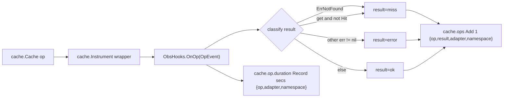
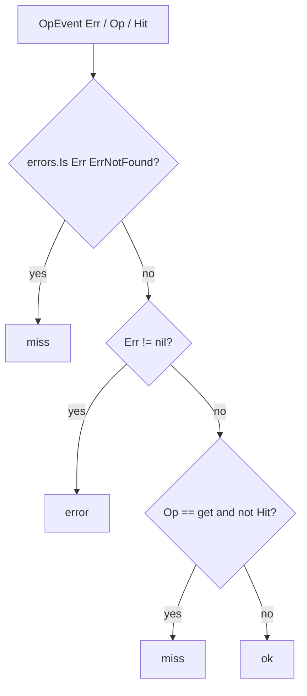

# cache-otel — OpenTelemetry cache metrics for Go

`cache-otel` exports **OpenTelemetry metrics for the [`github.com/ubgo/cache`](https://github.com/ubgo/cache) Go cache**. It adapts `cache.ObsHooks` (the core's zero-dependency observability seam) into OpenTelemetry instruments, so any `ubgo/cache` adapter — Redis, in-memory, multi-tier — emits operation counters and latency histograms through the OTel SDK to your OTLP collector, without the core ever importing the OpenTelemetry SDK.

It is a **separate Go module** at `contrib/cache-otel` inside the `ubgo/cache` repo. The core stays dependency-free; the OTel SDK is pulled in only if you import this.

## Documentation

A full per-feature cookbook (every exported symbol, use cases, runnable snippets, the created instruments, attributes, and result classification) lives in [`docs/README.md`](./docs/README.md) → [`docs/features.md`](./docs/features.md).

## Why cache-otel

- **Dependency isolation.** `github.com/ubgo/cache` has no OpenTelemetry dependency. Importing it is opt-in.
- **One-call wiring.** `cacheotel.New(...)` returns `cache.ObsHooks` ready for `cache.Instrument`.
- **Correct hit/miss accounting.** `cache.ErrNotFound` is classified as a `miss`, not an `error`.
- **Any meter.** Works with the SDK meter, a manual reader (great for tests), or an OTLP-backed `metric.Meter`.

## Features

- `cache.ops` `Int64Counter`, attributes `op`, `result`, `adapter`, `namespace`.
- `cache.op.duration` `Float64Histogram` (unit `s`), attributes `op`, `adapter`, `namespace`.
- `result` is one of `ok` / `miss` / `error` — misses are never counted as errors.
- Instrument-creation errors are returned, not panicked.

## Install

```sh
go get github.com/ubgo/cache/contrib/cache-otel@latest
```

Requires **Go 1.24+** and `github.com/ubgo/cache`.

## Quick start

```go
package main

import (
	"go.opentelemetry.io/otel"
	"github.com/ubgo/cache"
	cacheotel "github.com/ubgo/cache/contrib/cache-otel"
)

func instrument(backend cache.Cache) (cache.Cache, error) {
	hooks, err := cacheotel.New(otel.Meter("cache"), "redis", "billing")
	if err != nil {
		return nil, err // instrument creation failed
	}
	return cache.Instrument(backend, hooks), nil
}
```

## How it works



Every completed operation fires `OnOp` with an `OpEvent`. `cache-otel` classifies the outcome into a `result` attribute, adds `1` to the counter, and records the duration (in seconds) on the histogram. `adapter` / `namespace` are attached as base attributes to every point.

### Result classification



## Usage

### `New(meter, adapter, namespace)`

```go
func New(meter metric.Meter, adapter, namespace string) (cache.ObsHooks, error)
```

- `meter` — any `go.opentelemetry.io/otel/metric.Meter`. Use `otel.Meter("cache")` for the global SDK, or a meter from a `sdkmetric.NewMeterProvider` (including one backed by a `ManualReader` in tests).
- `adapter` — base attribute value identifying the backend (`"redis"`, `"memory"`).
- `namespace` — base attribute value identifying the logical cache (`"billing"`).

Returns `cache.ObsHooks` (pass to `cache.Instrument`) or an error if either instrument fails to build.

### Instruments

| Instrument | Type | Unit | Attributes |
|---|---|---|---|
| `cache.ops` | `Int64Counter` | — | `op`, `result`, `adapter`, `namespace` |
| `cache.op.duration` | `Float64Histogram` | `s` | `op`, `adapter`, `namespace` |

`result` is `ok`, `miss`, or `error`. The histogram omits `result` to keep series cardinality bounded; latency is recorded for every operation.

### Testing with a manual reader

```go
reader := sdkmetric.NewManualReader()
mp := sdkmetric.NewMeterProvider(sdkmetric.WithReader(reader))

hooks, err := cacheotel.New(mp.Meter("cache"), "memory", "test")
if err != nil {
	t.Fatal(err)
}
c := cache.Instrument(backend, hooks)

_, _ = c.Get(context.Background(), "missing") // generates a miss

var rm metricdata.ResourceMetrics
if err := reader.Collect(context.Background(), &rm); err != nil {
	t.Fatal(err)
}
// Assert on rm.ScopeMetrics for cache.ops with result="miss".
```

This is the recommended unit-test pattern: a `ManualReader` lets you `Collect()` synchronously and assert on the metric points without an exporter or collector.

## When to use this vs cache-prom

Use `cache-otel` if your observability pipeline is OpenTelemetry / OTLP. Use [`cache-prom`](../cache-prom) if you scrape Prometheus directly. Both wrap the same `cache.ObsHooks` seam with identical result classification — choose the one matching your metrics backend. Registering both is fine if you need a dual export path.

## FAQ

### How do I get OpenTelemetry metrics for a Go cache?

Call `cacheotel.New(meter, adapter, namespace)` and pass the returned `cache.ObsHooks` to `cache.Instrument(backend, hooks)`.

### Why isn't `ErrNotFound` an error?

A cache miss is normal. `cache-otel` maps `cache.ErrNotFound` (and a `get` with `Hit == false`) to `result="miss"`, leaving `result="error"` for genuine backend failures, so SLOs aren't skewed.

### Does this add an OpenTelemetry dependency to `github.com/ubgo/cache`?

No. This is a separate module. The core only defines `cache.ObsHooks`; the OTel SDK is pulled in solely when you import `contrib/cache-otel`.

### What meter should I pass?

The global `otel.Meter("cache")` in production, or a `ManualReader`-backed meter provider's meter in tests so you can `Collect()` and assert synchronously.

### What unit is the duration histogram in?

Seconds. The instrument is created with `metric.WithUnit("s")` and records `ev.Duration.Seconds()`.

## Related

- [`github.com/ubgo/cache`](https://github.com/ubgo/cache) — core interface, `ObsHooks`, `Instrument`.
- [`cache-prom`](../cache-prom) — the Prometheus equivalent.
