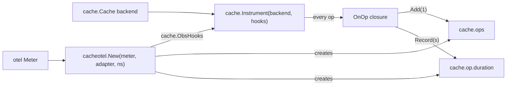

# cache-otel — documentation

Per-feature cookbook for `github.com/ubgo/cache/contrib/cache-otel`, the OpenTelemetry metrics exporter for [`github.com/ubgo/cache`](https://github.com/ubgo/cache).

One exported constructor wires the core's zero-dependency `cache.ObsHooks` seam to OTel instruments. The behaviour that matters (instrument set, attributes, result classification, concurrency-safe attribute slices) is documented per symbol in [`features.md`](./features.md).

## Index

| Symbol | Kind | What it is |
|---|---|---|
| [`New`](./features.md#new) | func | Builds two OTel instruments on a `metric.Meter` and returns `cache.ObsHooks` wired to them. |

No other exported identifiers. The instruments it creates (`cache.ops`, `cache.op.duration`) are owned by the returned closure and are documented in [`features.md`](./features.md#created-instruments) but are not Go-level exports.

## How it fits together

## See also

- [`features.md`](./features.md) — full per-symbol cookbook.
- Module [`README.md`](../README.md) — overview and rationale.
- Core [`cache`](https://github.com/ubgo/cache) docs for `cache.Instrument` / `cache.ObsHooks`.
