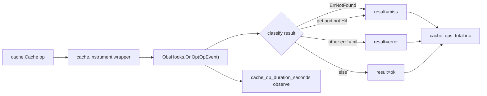
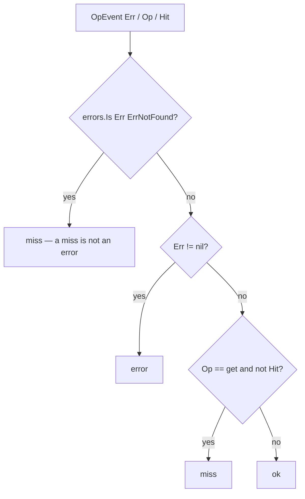

# cache-prom — Prometheus metrics for Go cache

`cache-prom` exports **Prometheus metrics for the [`github.com/ubgo/cache`](https://github.com/ubgo/cache) Go cache**. It adapts `cache.ObsHooks` (the core's zero-dependency observability seam) into Prometheus collectors, so you get per-operation counters and latency histograms for any `ubgo/cache` adapter — Redis, in-memory, multi-tier — without the core ever importing the Prometheus client.

It is a **separate Go module** that lives in `contrib/cache-prom` inside the `ubgo/cache` repo. The core stays dependency-free; the Prometheus client is only pulled in if you import this.

## Why cache-prom

- **Dependency isolation.** `github.com/ubgo/cache` has no Prometheus dependency. Apps that don't want it don't pay for it.
- **One-call wiring.** `cacheprom.New(...)` returns `cache.ObsHooks` ready to pass to `cache.Instrument`.
- **Correct hit/miss accounting.** `cache.ErrNotFound` is classified as a `miss`, **not** an `error` — so your error rate isn't polluted by normal cache misses.
- **Multi-cache safe.** `adapter` and `namespace` become constant labels, so several caches can register on one registry.

## Features

- `cache_ops_total` counter, labelled by `op`, `result`, `adapter`, `namespace`.
- `cache_op_duration_seconds` histogram (`prometheus.DefBuckets`), labelled by `op`, `adapter`, `namespace`.
- `result` is one of `ok` / `miss` / `error` — misses are never counted as errors.
- Registration errors (e.g. duplicate metric) are returned, not panicked.

## Install

```sh
go get github.com/ubgo/cache/contrib/cache-prom@latest
```

Requires **Go 1.24+** and `github.com/ubgo/cache`.

## Quick start

```go
package main

import (
	"net/http"

	"github.com/prometheus/client_golang/prometheus"
	"github.com/prometheus/client_golang/prometheus/promhttp"
	"github.com/ubgo/cache"
	cacheprom "github.com/ubgo/cache/contrib/cache-prom"
)

func instrument(backend cache.Cache) (cache.Cache, error) {
	hooks, err := cacheprom.New(prometheus.DefaultRegisterer, "redis", "billing")
	if err != nil {
		return nil, err // e.g. duplicate registration
	}
	http.Handle("/metrics", promhttp.Handler())
	return cache.Instrument(backend, hooks), nil
}
```

## How it works



Every completed operation fires `OnOp` with an `OpEvent`. `cache-prom` classifies the outcome into `result`, increments the counter, and observes the duration. `adapter` / `namespace` are baked in as constant labels at construction time.

### Result classification



## Usage

### `New(reg, adapter, namespace)`

```go
func New(reg prometheus.Registerer, adapter, namespace string) (cache.ObsHooks, error)
```

- `reg` — any `prometheus.Registerer` (`prometheus.DefaultRegisterer`, or a custom `prometheus.NewRegistry()`).
- `adapter` — a constant label value identifying the backend (`"redis"`, `"memory"`, `"multitier"`).
- `namespace` — a constant label value identifying the logical cache (`"billing"`, `"sessions"`).

Returns `cache.ObsHooks` (pass to `cache.Instrument`) or an error if either collector fails to register — most commonly a **duplicate registration** when you call `New` twice with the same `adapter`/`namespace`/registry, or when another collector already owns the metric name.

### Registered metrics

| Metric | Type | Labels | Meaning |
|---|---|---|---|
| `cache_ops_total` | counter | `op`, `result`, `adapter`, `namespace` | Count of operations. `result` is `ok`, `miss`, or `error`. |
| `cache_op_duration_seconds` | histogram | `op`, `adapter`, `namespace` | Operation latency, `prometheus.DefBuckets`. |

`adapter` and `namespace` are **constant labels** (set once in `New`), so multiple caches can safely share one registry without colliding.

### Using a private registry per cache

```go
reg := prometheus.NewRegistry()
hooks, err := cacheprom.New(reg, "memory", "sessions")
if err != nil {
	log.Fatal(err)
}
sessions := cache.Instrument(memBackend, hooks)
http.Handle("/metrics/sessions", promhttp.HandlerFor(reg, promhttp.HandlerOpts{}))
```

### Example queries

Hit ratio over 5 minutes:

```promql
sum(rate(cache_ops_total{result="ok",op="get"}[5m]))
/
sum(rate(cache_ops_total{op="get"}[5m]))
```

Error rate (misses excluded by design):

```promql
sum(rate(cache_ops_total{result="error"}[5m])) by (adapter, namespace)
```

p99 get latency:

```promql
histogram_quantile(0.99, sum(rate(cache_op_duration_seconds_bucket{op="get"}[5m])) by (le))
```

## When to use this vs cache-otel

Use `cache-prom` if your stack scrapes Prometheus / exposes a `/metrics` endpoint. Use [`cache-otel`](../cache-otel) if you export through the OpenTelemetry SDK to an OTLP collector. They wrap the same `cache.ObsHooks` seam with identical result classification — pick the one matching your metrics pipeline. You can register both hooks if you need a dual path (each is an independent `ObsHooks`).

## FAQ

### How do I get Prometheus metrics for a Go cache?

Call `cacheprom.New(reg, adapter, namespace)` and pass the returned `cache.ObsHooks` to `cache.Instrument(backend, hooks)`. Expose the registry via `promhttp`.

### Why isn't `ErrNotFound` counted as an error?

A cache miss is normal, expected behavior — counting it as an error would make every cache look broken. `cache-prom` maps `cache.ErrNotFound` (and a `get` with `Hit == false`) to `result="miss"`, leaving `result="error"` for genuine backend failures.

### I got a "duplicate metrics collector registration attempted" error.

You called `New` twice against the same registry with the same const labels, or another collector already uses `cache_ops_total` / `cache_op_duration_seconds`. Use distinct `adapter`/`namespace` values, or a separate `prometheus.NewRegistry()` per cache. The error is returned, not panicked, so you can handle it.

### Does this add a Prometheus dependency to `github.com/ubgo/cache`?

No. This is a separate module. The core only defines `cache.ObsHooks`; the Prometheus client is pulled in solely when you import `contrib/cache-prom`.

### Can multiple caches share one registry?

Yes — that is the purpose of the constant `adapter`/`namespace` labels. Give each cache distinct label values.

## Related

- [`github.com/ubgo/cache`](https://github.com/ubgo/cache) — core interface, `ObsHooks`, `Instrument`.
- [`cache-otel`](../cache-otel) — the OpenTelemetry equivalent.
