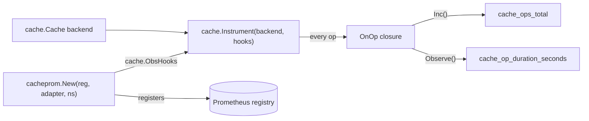

# cache-prom — documentation

Per-feature cookbook for `github.com/ubgo/cache/contrib/cache-prom`, the Prometheus exporter for [`github.com/ubgo/cache`](https://github.com/ubgo/cache).

This module is tiny on the surface — one constructor — but the behaviour it wires up (label model, result classification, registry sharing) is where the value is. Each exported symbol below has its own section in [`features.md`](./features.md) with concrete use cases and a runnable snippet.

## Index

| Symbol | Kind | What it is |
|---|---|---|
| [`New`](./features.md#new) | func | Registers the two collectors on a registry and returns `cache.ObsHooks` wired to them. |

There are no other exported identifiers in this package. The metrics it registers (`cache_ops_total`, `cache_op_duration_seconds`) are Prometheus collectors owned internally by the closure `New` returns — they are documented in [`features.md`](./features.md#registered-metrics) but are not Go-level exports.

## How it fits together

```
backend (any cache.Cache)  ──►  cache.Instrument(backend, hooks)  ──►  instrumented Cache
                                          ▲
                cacheprom.New(reg, "redis", "billing") ──┘   (returns cache.ObsHooks)
                          │
                          └──► registers cache_ops_total + cache_op_duration_seconds on reg
```



## See also

- [`features.md`](./features.md) — full per-symbol cookbook.
- Module [`README.md`](../README.md) — overview and rationale.
- Core [`cache`](https://github.com/ubgo/cache) docs for `cache.Instrument` / `cache.ObsHooks`.
