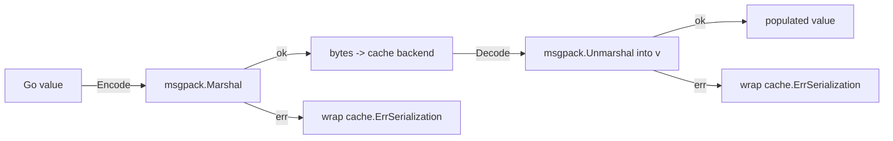

# codec-msgpack — MessagePack codec for Go cache

`codec-msgpack` is a **MessagePack `cache.Codec` for the [`github.com/ubgo/cache`](https://github.com/ubgo/cache) Go cache**. It serializes cached values with [MessagePack](https://msgpack.org) instead of JSON or Gob: more compact and faster than JSON, while staying cross-language so other services can read the same bytes.

It is a **separate Go module** at `contrib/codec-msgpack` inside the `ubgo/cache` repo. The core stays dependency-free; the msgpack library is only pulled in when you import this.

## Documentation

A full per-feature cookbook (every exported symbol, use cases, runnable snippets, error wrapping, and JSON/Gob tradeoffs) lives in [`docs/README.md`](./docs/README.md) → [`docs/features.md`](./docs/features.md).

## Why codec-msgpack

- **Smaller payloads.** MessagePack's binary encoding is materially smaller than JSON for typical structs — less Redis memory, less network.
- **Faster encode/decode** than `encoding/json` for most workloads.
- **Cross-language.** Unlike Gob, MessagePack is readable by Python, Ruby, JS, etc., so a polyglot fleet can share a cache.
- **Drop-in.** Implements `cache.Codec`; pass it via `cache.WithCodec` anywhere a codec is accepted.

## Features

- `Codec.Name()` returns `"msgpack"`.
- `Encode` / `Decode` over `github.com/vmihailenco/msgpack/v5`.
- All failures wrapped with `cache.ErrSerialization` (so `errors.Is(err, cache.ErrSerialization)` works).
- Zero configuration — `codecmsgpack.Codec{}` is a stateless value.

## Install

```sh
go get github.com/ubgo/cache/contrib/codec-msgpack@latest
```

Requires **Go 1.24+** and `github.com/ubgo/cache`.

## Quick start

```go
package main

import (
	"context"
	"time"

	"github.com/ubgo/cache"
	codecmsgpack "github.com/ubgo/cache/contrib/codec-msgpack"
)

type User struct {
	ID   int    `msgpack:"id"`
	Name string `msgpack:"name"`
}

func loadUser(ctx context.Context, c cache.Cache) (User, error) {
	return cache.Remember(ctx, c, "user:42", time.Minute,
		func(ctx context.Context) (User, error) {
			return User{ID: 42, Name: "Ada"}, nil
		},
		cache.WithCodec(codecmsgpack.Codec{}),
	)
}
```

## How it works



`Encode` calls `msgpack.Marshal`; `Decode` calls `msgpack.Unmarshal` into the caller's destination. Any library error is wrapped as `%w` around `cache.ErrSerialization`, so callers can branch with `errors.Is(err, cache.ErrSerialization)`.

## Usage

### The codec

```go
type Codec struct{}

func (Codec) Name() string
func (Codec) Encode(v any) ([]byte, error)
func (Codec) Decode(data []byte, v any) error
```

It is a stateless zero-value struct (`codecmsgpack.Codec{}`); share one freely across goroutines.

### As the default codec for a cache

```go
c := cache.New(backend, cache.WithCodec(codecmsgpack.Codec{}))
```

### Per-call override

```go
v, err := cache.Remember(ctx, c, key, ttl, load,
	cache.WithCodec(codecmsgpack.Codec{}))
```

### Wrapping with compression

Compose with [`codec-zstd`](../codec-zstd) to compress large MessagePack blobs:

```go
codec := codeczstd.New(codecmsgpack.Codec{})
v, _ := cache.Remember(ctx, c, key, ttl, load, cache.WithCodec(codec))
```

### Error handling

```go
v, err := cache.Remember(ctx, c, key, ttl, load,
	cache.WithCodec(codecmsgpack.Codec{}))
if errors.Is(err, cache.ErrSerialization) {
	// value wasn't msgpack-encodable, or stored bytes were corrupt/foreign
}
```

## When to use this vs the built-in JSON/Gob codec

- **vs JSON:** choose msgpack when payload size and encode/decode speed matter and you don't need human-readable cache values. JSON is better when you want to eyeball cached bytes (e.g. via `cache-cli get`).
- **vs Gob:** choose msgpack when other (non-Go) services must read the cache. Gob is Go-only and not version-tolerant across differing struct definitions. Use Gob only for Go-to-Go caches where its self-describing types are convenient.
- **vs protobuf** ([`codec-protobuf`](../codec-protobuf)): use protobuf when you already have `.proto` schemas and need strict schema evolution. Use msgpack when you want schemaless structs without codegen.

## FAQ

### How do I use MessagePack for my Go cache values?

Pass `codecmsgpack.Codec{}` via `cache.WithCodec(...)`, either as the cache default or per `Remember`/typed call.

### Is it faster and smaller than JSON?

Generally yes for typical structs — MessagePack is a compact binary format. Measure with your own payloads if size/latency is critical.

### Can other languages read the cached bytes?

Yes. MessagePack has implementations across most languages, unlike Go's Gob.

### How do I detect a serialization failure?

`errors.Is(err, cache.ErrSerialization)`. Both encode and decode failures are wrapped with it.

### Does this add a dependency to `github.com/ubgo/cache`?

No. It's a separate module; `github.com/vmihailenco/msgpack/v5` is only pulled in when you import `contrib/codec-msgpack`.

## Related

- [`github.com/ubgo/cache`](https://github.com/ubgo/cache) — core interface, `Codec`, `WithCodec`.
- [`codec-zstd`](../codec-zstd) — compose for compression.
- [`codec-protobuf`](../codec-protobuf) — schema-driven alternative.
