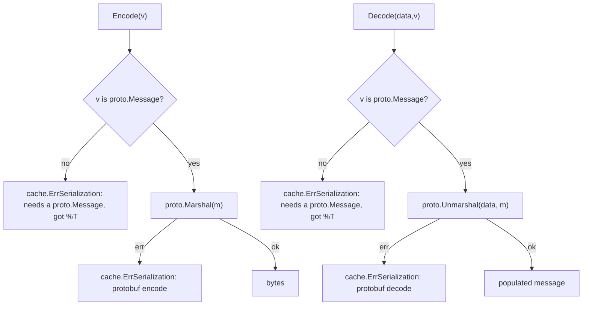

# codec-protobuf — Protobuf codec for Go cache

`codec-protobuf` is a **Protocol Buffers `cache.Codec` for the [`github.com/ubgo/cache`](https://github.com/ubgo/cache) Go cache**. It serializes cached values with the Protobuf wire format: compact, strongly schema-evolvable, and interoperable with any other service that speaks your `.proto` schemas.

It is a **separate Go module** at `contrib/codec-protobuf` inside the `ubgo/cache` repo. The core stays dependency-free; the protobuf runtime is only pulled in when you import this.

## Why codec-protobuf

- **Schema evolution.** Add/deprecate fields without breaking old cached entries — Protobuf's whole point.
- **Compact + fast.** Binary wire format, smaller than JSON, fast to (de)serialize.
- **Cross-service interop.** Other services already consuming your `.proto` types can read the cache.
- **Fail loud, not silent.** Non-`proto.Message` values are rejected with `cache.ErrSerialization` instead of being silently corrupted.

## Features

- `Codec.Name()` returns `"protobuf"`.
- `Encode` requires a `proto.Message`; `Decode` requires a non-nil `proto.Message` pointer.
- Type mismatches and (un)marshal failures wrapped with `cache.ErrSerialization`.
- Stateless zero-value struct.

## Install

```sh
go get github.com/ubgo/cache/contrib/codec-protobuf@latest
```

Requires **Go 1.24+**, `github.com/ubgo/cache`, and generated `proto.Message` types (`google.golang.org/protobuf`).

## Quick start

```go
package main

import (
	"context"
	"time"

	"github.com/ubgo/cache"
	codecprotobuf "github.com/ubgo/cache/contrib/codec-protobuf"
	userpb "example.com/gen/user/v1" // generated proto package
)

func loadUser(ctx context.Context, c cache.Cache) (*userpb.User, error) {
	return cache.Remember(ctx, c, "user:42", time.Minute,
		func(ctx context.Context) (*userpb.User, error) {
			return &userpb.User{Id: 42, Name: "Ada"}, nil
		},
		cache.WithCodec(codecprotobuf.Codec{}),
	)
}
```

The cached type must be a generated `proto.Message` (e.g. `*userpb.User`).

## How it works



Both `Encode` and `Decode` first **type-assert** the value to `proto.Message`. A non-proto value is a programmer error and fails fast with `cache.ErrSerialization` (including the offending `%T`) rather than writing garbage into the cache.

## Usage

### The codec

```go
type Codec struct{}

func (Codec) Name() string                       // "protobuf"
func (Codec) Encode(v any) ([]byte, error)        // v must be a proto.Message
func (Codec) Decode(data []byte, v any) error     // v must be a non-nil proto.Message pointer
```

Stateless zero value (`codecprotobuf.Codec{}`); share one across goroutines.

### As the default codec

```go
c := cache.New(backend, cache.WithCodec(codecprotobuf.Codec{}))
```

### Per-call override

```go
v, err := cache.Remember(ctx, c, key, ttl, load,
	cache.WithCodec(codecprotobuf.Codec{}))
```

### Error handling

```go
v, err := cache.Remember(ctx, c, key, ttl, load,
	cache.WithCodec(codecprotobuf.Codec{}))
if errors.Is(err, cache.ErrSerialization) {
	// value wasn't a proto.Message, or wire bytes didn't match the schema
}
```

### Composing with compression

```go
codec := codeczstd.New(codecprotobuf.Codec{})
v, _ := cache.Remember(ctx, c, key, ttl, load, cache.WithCodec(codec))
```

## When to use this vs the built-in JSON/Gob codec

- **vs JSON:** use protobuf when you have `.proto` schemas, need strict schema evolution, and want compact binary entries. JSON is better for ad-hoc structs you want to read with `cache-cli`.
- **vs Gob:** Gob is Go-only and tied to your struct definitions. Protobuf is the right choice for cross-service caches and long-lived entries that must survive schema changes.
- **vs msgpack** ([`codec-msgpack`](../codec-msgpack)): use protobuf when the schema and codegen already exist and evolution guarantees matter; use msgpack for schemaless structs without a codegen step.

## FAQ

### How do I cache Protobuf messages in Go?

Pass `codecprotobuf.Codec{}` via `cache.WithCodec`. Cache only generated `proto.Message` types.

### What happens if I cache a non-proto value?

`Encode`/`Decode` return `cache.ErrSerialization` with the offending `%T` in the message — it fails loudly instead of corrupting the cache.

### Does `Decode` need a non-nil pointer?

Yes — `Decode`'s `v` must be a non-nil `proto.Message` pointer for `proto.Unmarshal` to populate it.

### How do I detect serialization failures?

`errors.Is(err, cache.ErrSerialization)` covers both type-mismatch and wire (un)marshal failures.

### Does this add a dependency to `github.com/ubgo/cache`?

No. Separate module; `google.golang.org/protobuf` is pulled in only when you import `contrib/codec-protobuf`.

## Related

- [`github.com/ubgo/cache`](https://github.com/ubgo/cache) — core interface, `Codec`, `WithCodec`.
- [`codec-zstd`](../codec-zstd) — compose for compression.
- [`codec-msgpack`](../codec-msgpack) — schemaless alternative.
