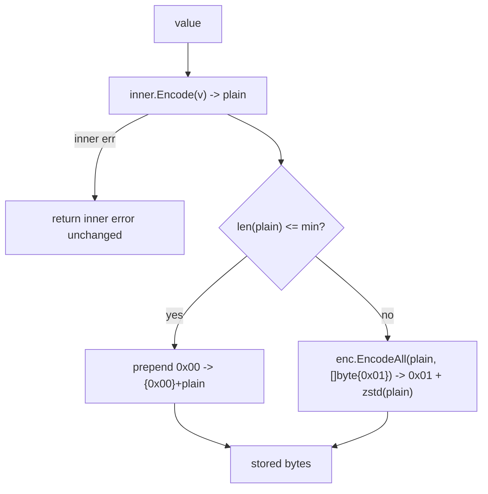
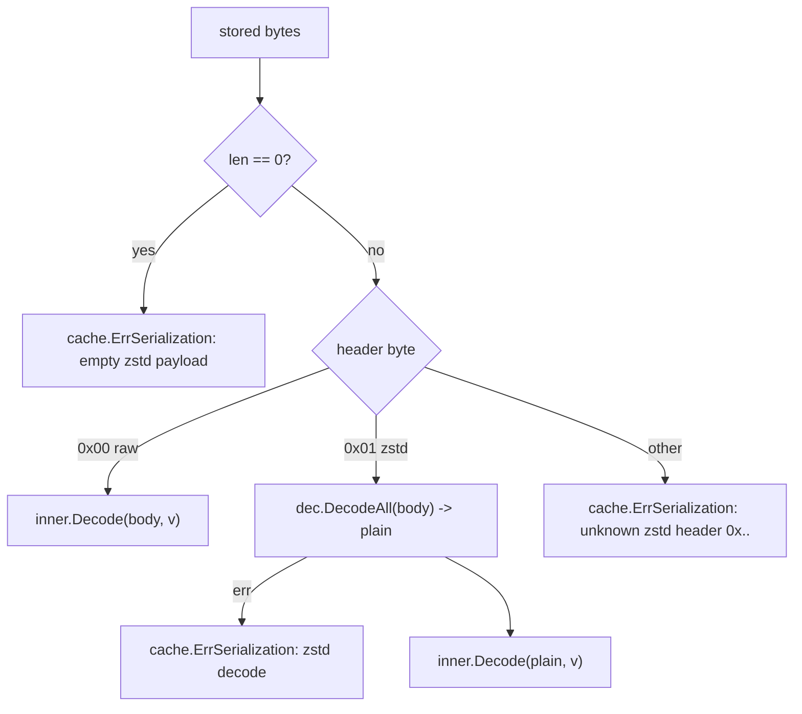

# codec-zstd — zstd compression for Go cache

`codec-zstd` adds **zstd compression to the [`github.com/ubgo/cache`](https://github.com/ubgo/cache) Go cache**. It wraps *any* `cache.Codec` (JSON, Gob, msgpack, protobuf, …) and transparently compresses values that are large enough to benefit, leaving small values untouched. A 1-byte header records which path was taken so decoding is always unambiguous.

It is a **separate Go module** at `contrib/codec-zstd` inside the `ubgo/cache` repo. The core stays dependency-free; `klauspost/compress` is only pulled in when you import this.

## Documentation

A full per-feature cookbook (every exported symbol, use cases, runnable snippets, the 0x00/0x01 framing, threshold rationale, and compose-with-encrypt ordering) lives in [`docs/README.md`](./docs/README.md) → [`docs/features.md`](./docs/features.md).

## Why codec-zstd

- **Smaller Redis footprint / less network** for large cached values (HTML, JSON blobs, rendered pages).
- **No regression on small values.** Compressing tiny payloads adds bytes and CPU for nothing — `codec-zstd` skips compression at/below a configurable threshold.
- **Composable.** It wraps an inner codec, so you keep your existing serialization (msgpack, protobuf, JSON) and just add compression.
- **Self-describing.** A 1-byte framing header means `Decode` never has to guess; corrupt or unknown framing fails with `cache.ErrSerialization` instead of producing garbage.

## Features

- Wraps any `cache.Codec`; defaults to `cache.DefaultCodec` if `nil`.
- Size threshold via `WithMinBytes` (default **16 KiB**); at or below it, store raw.
- 1-byte header: `0x00` = raw inner bytes, `0x01` = zstd-compressed inner bytes.
- `Name()` = `"zstd+" + inner.Name()` (e.g. `zstd+json`).
- Unknown header / empty payload / corrupt body → `cache.ErrSerialization`.

## Install

```sh
go get github.com/ubgo/cache/contrib/codec-zstd@latest
```

Requires **Go 1.24+** and `github.com/ubgo/cache`.

## Quick start

```go
package main

import (
	"context"
	"time"

	"github.com/ubgo/cache"
	codeczstd "github.com/ubgo/cache/contrib/codec-zstd"
)

func cached(ctx context.Context, c cache.Cache) (string, error) {
	codec := codeczstd.New(cache.DefaultCodec) // wrap the default codec
	return cache.Remember(ctx, c, "page:home", time.Minute,
		func(ctx context.Context) (string, error) {
			return renderLargeHTML(), nil
		},
		cache.WithCodec(codec),
	)
}
```

Tune the threshold:

```go
codec := codeczstd.New(cache.DefaultCodec, codeczstd.WithMinBytes(1<<14)) // 16 KiB
```

## How it works

### Encode — size-thresholded compression + 1-byte framing



### Decode — header dispatch



The header byte is the first byte of every stored value: `0x00` means "the rest is raw inner-codec bytes", `0x01` means "the rest is a zstd frame of inner-codec bytes". This makes `Decode` deterministic regardless of the threshold the value was written under — you can change `WithMinBytes` later and old entries still decode correctly.

## Usage

### `New(inner, opts...)`

```go
func New(inner cache.Codec, opts ...Option) *Codec
```

- `inner` — the codec to wrap. If `nil`, `cache.DefaultCodec` is used.
- Returns a `*Codec` implementing `cache.Codec`.

The zstd encoder/decoder are created once in `New` (with `nil` writer/reader, configured for `EncodeAll`/`DecodeAll`) and reused — `*Codec` is safe for concurrent use.

### `WithMinBytes(n)`

```go
func WithMinBytes(n int) Option
```

Sets the threshold in **encoded** bytes. Values whose inner-encoded length is `<= n` are stored raw (header `0x00`); larger values are zstd-compressed (header `0x01`). Default `1 << 14` (16 KiB). Compressing tiny payloads is a net loss in both size (zstd framing overhead) and CPU, hence the floor.

### `Name()`

Returns `"zstd+" + inner.Name()`, e.g. `zstd+json`, `zstd+msgpack` — so the effective codec is identifiable in logs / tooling.

### Composing with another codec

```go
codec := codeczstd.New(codecmsgpack.Codec{}, codeczstd.WithMinBytes(4096))
c := cache.New(backend, cache.WithCodec(codec))
```

### Error handling

```go
_, err := cache.Remember(ctx, c, key, ttl, load,
	cache.WithCodec(codeczstd.New(cache.DefaultCodec)))
if errors.Is(err, cache.ErrSerialization) {
	// empty payload, unknown header byte, or a corrupt zstd frame
}
```

## When to use this vs the built-in JSON/Gob codec

`codec-zstd` is not an alternative codec — it is a **wrapper** around one. Use it *in addition to* JSON/Gob/msgpack/protobuf when cached values are large enough that storage or bandwidth matters (rendered pages, big JSON documents, aggregates). For small values it is effectively a no-op (header byte aside), so the cost of leaving it on is negligible. Skip it only if every value is tiny and the 1-byte header overhead is unacceptable, or if the data is already incompressible (e.g. encrypted/compressed blobs) — in which case wrapping just burns CPU. For encryption, compress *before* encrypting (compose `codec-zstd` inside an encrypting codec), since ciphertext does not compress.

## FAQ

### How do I compress my Go cache values with zstd?

Wrap your codec: `codeczstd.New(yourCodec)` and pass it via `cache.WithCodec`. Large values are compressed automatically.

### Why are small values stored uncompressed?

Below the threshold (default 16 KiB) zstd framing overhead and CPU cost outweigh any size win. The 1-byte header lets `Decode` handle both cases transparently.

### Can I change the threshold after data is already cached?

Yes. The header byte records per-value which path was used, so old entries decode correctly regardless of the current `WithMinBytes` setting.

### What does `Name()` return?

`"zstd+" + inner.Name()`, so a JSON inner codec yields `zstd+json`. Useful for identifying the effective codec in tooling.

### How are corrupt entries handled?

An empty payload, an unknown header byte, or a corrupt zstd frame all return `cache.ErrSerialization` — never a panic or silent garbage.

### Does this add a dependency to `github.com/ubgo/cache`?

No. Separate module; `github.com/klauspost/compress` is pulled in only when you import `contrib/codec-zstd`.

## Related

- [`github.com/ubgo/cache`](https://github.com/ubgo/cache) — core interface, `Codec`, `DefaultCodec`, `WithCodec`.
- [`codec-msgpack`](../codec-msgpack) / [`codec-protobuf`](../codec-protobuf) — inner codecs worth wrapping.
