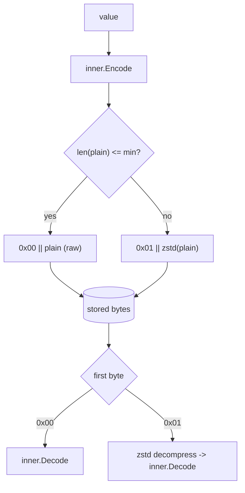

# codec-zstd — documentation

Per-feature cookbook for `github.com/ubgo/cache/contrib/codec-zstd`, a size-thresholded zstd compressing codec **wrapper** for [`github.com/ubgo/cache`](https://github.com/ubgo/cache).

It wraps any inner `cache.Codec` (JSON, Gob, msgpack, protobuf, …) and compresses values that are large enough to benefit; small values are stored raw. A 1-byte framing header makes `Decode` unambiguous and threshold-independent. Each export has a section in [`features.md`](./features.md).

## Index

| Symbol | Kind | What it is |
|---|---|---|
| [`New`](./features.md#new) | func | Wraps an inner codec with zstd compression; takes functional options. |
| [`Option`](./features.md#option) | type | Functional-option type configuring `New`. |
| [`WithMinBytes`](./features.md#withminbytes) | func | Option setting the encoded-size threshold above which zstd is applied. |
| [`Codec`](./features.md#codec) | type | The wrapping codec returned by `New` (implements `cache.Codec`). |
| [`Codec.Name`](./features.md#codecname) | method | Returns `"zstd+"` + inner codec name. |
| [`Codec.Encode`](./features.md#codecencode) | method | Inner-encodes, then compresses if over the threshold; writes the framing header. |
| [`Codec.Decode`](./features.md#codecdecode) | method | Dispatches on the framing header, decompresses if needed, inner-decodes. |

## Framing

## See also

- [`features.md`](./features.md) — full per-symbol cookbook, threshold rationale, compose-with-encrypt ordering.
- Module [`README.md`](../README.md) — overview and rationale.
- Core [`cache`](https://github.com/ubgo/cache) docs for `cache.WithCodec` / `cache.Codec` / `cache.DefaultCodec`.
