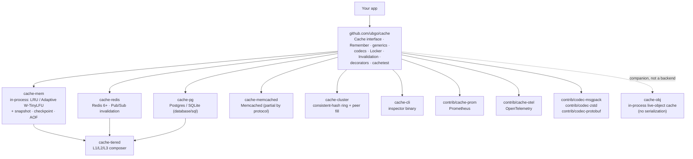

# The ubgo/cache family

`ubgo/cache` is one bytes-level cache contract with a family of independent,
go-gettable modules around it. You depend only on what you use — the core has
**zero third-party dependencies**, and each backend/exporter/codec is its own
module so its dependencies never enter your build unless you import it.

## Map



## Modules

| Module | Import path | Use it when |
|---|---|---|
| **core** | `github.com/ubgo/cache` | Always — the `Cache` interface, `Remember`, generics, codecs, `Locker`, `Invalidation`, the resilience/observability decorators, and the `cachetest` conformance suite. |
| **cache-mem** | `github.com/ubgo/cache-mem` | A fast in-process cache. Adaptive W-TinyLFU (Caffeine-class hit rate) by default; optional snapshot/checkpoint/AOF for warm restarts. |
| **cache-redis** | `github.com/ubgo/cache-redis` | A cache shared across processes/pods; also provides a Pub/Sub `Invalidation` bus. |
| **cache-pg** | `github.com/ubgo/cache-pg` | A durable cache when you already run Postgres and don't want another datastore (SQLite for tests/embedded). |
| **cache-memcached** | `github.com/ubgo/cache-memcached` | Interop with an existing Memcached fleet. Partial by protocol design (no TTL read / prefix scan / iterate). |
| **cache-tiered** | `github.com/ubgo/cache-tiered` | L1 (mem) in front of L2/L3 (Redis/PG) with read-promotion and cross-process invalidation. |
| **cache-cluster** | `github.com/ubgo/cache-cluster` | Peer-aware distribution: consistent-hash ring + single-flight HTTP peer fill (groupcache-style). |
| **cache-cli** | `github.com/ubgo/cache-cli` | A shell/CI tool to inspect a live Redis-backed cache. |
| **cache-obj** | `github.com/ubgo/cache-obj` | An in-process cache for **live objects** that must not be serialized (compiled `*regexp.Regexp`, `*http.Client`, connections, ORM entities you traverse). A companion abstraction — typed `Cache[T]`, NOT a `cache.Cache` backend. Use it when you need the *same instance* back, not its serialized data. |
| **contrib/cache-prom**, **contrib/cache-otel** | `github.com/ubgo/cache/contrib/...` | Export hit/miss/latency to Prometheus or OpenTelemetry via `cache.Instrument`. |
| **contrib/codec-msgpack**, **codec-zstd**, **codec-protobuf** | `github.com/ubgo/cache/contrib/...` | Swap the value codec (compact, compressed, or schema-evolved) via `cache.WithCodec`. |

## How they compose

Everything is a `cache.Cache`, so adapters and decorators stack freely:

```go
backend := rediscache.New(rdb)                         // cache-redis
backend  = cache.NewCircuitBreaker(backend)            // resilience
backend  = cache.NewRetry(backend)
backend  = cache.Instrument(backend, promHooks)        // contrib/cache-prom
c := tieredcache.New(                                   // cache-tiered
    tieredcache.WithL1(memcache.New()),                 // cache-mem
    tieredcache.WithL2(backend),
    tieredcache.WithInvalidation(rediscache.NewInvalidation(rdb, "inv")),
)
user, err := cache.Remember(ctx, c, "user:42", time.Minute, loadUser) // core
```

Pick one backend, wrap with the decorators you need, reach for `tiered`/
`cluster` only when the topology calls for it. Every backend passes the same
`cachetest.Run` conformance suite, so swapping one for another never changes
behavior your code depends on.

## Versioning

Released at **`v0.1.0`**, synchronized across every module (contrib modules carry path tags like `contrib/codec-zstd/v0.1.0`). Pin it: `go get github.com/ubgo/cache@v0.1.0` (and likewise for each adapter / `github.com/ubgo/cache/contrib/<name>@v0.1.0`). `@latest` also works and tracks the newest tag. SemVer is followed; majors bump together across the family so adapters never mismatch the core.
