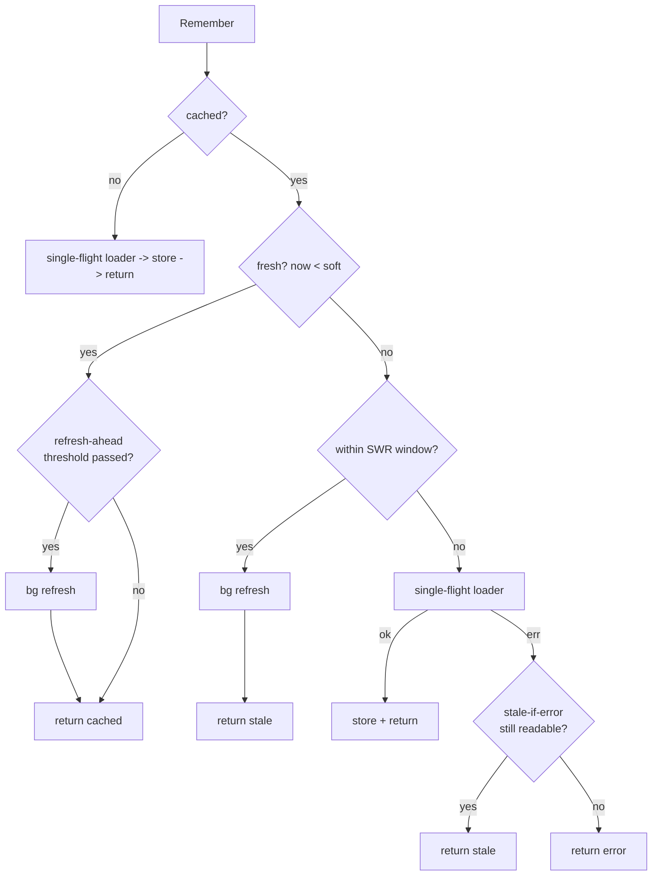

# Remember — load-through with stampede protection

`Remember` is the workhorse: return the cached value, or single-flight `fn` on
a miss and store the result. It composes refresh-ahead,
stale-while-revalidate, stale-if-error, negative caching and TTL jitter.

```go
import (
	"context"
	"time"

	"github.com/ubgo/cache"
	mem "github.com/ubgo/cache-mem"
)

type User struct{ ID int; Name string }
```

---

### `Remember[T](ctx, c, key, ttl, fn, opts...) (T, error)`

One-line: cache-aside in a single call, with concurrent misses collapsed to
exactly one loader call (single-flight, scoped per cache instance).

Use cases:
- Cache an expensive DB/RPC read keyed by ID.
- Protect a hot key from a thundering herd on cold-start or expiry.
- Memoize a slow computed value (report, aggregate).

```go
c := mem.New()
ctx := context.Background()

u, err := cache.Remember(ctx, c, "user:42", 5*time.Minute,
	func(ctx context.Context) (User, error) {
		return loadUserFromDB(ctx, 42) // runs at most once across N concurrent callers
	})
_ = u
_ = err
```

The decision path on each call:



### `LoadFn[T]`

`type LoadFn[T any] func(ctx context.Context) (T, error)` — computes a value on
miss or background refresh. Return `cache.ErrNotFound` to signal "no such
value" (works with `WithNegativeTTL`).

```go
var load cache.LoadFn[User] = func(ctx context.Context) (User, error) {
	u, ok := db.User(ctx, 42)
	if !ok {
		return User{}, cache.ErrNotFound
	}
	return u, nil
}
```

---

## Options (`RememberOpt`)

`type RememberOpt func(*rememberCfg)` — pass any combination to `Remember`,
`GetT`, `SetT`, `RememberMulti`, `Memoize`, `Once`, `Warm`, or bake them into a
[`Typed[T]`](./generics.md).

### `WithCodec(c Codec)`

Override the serializer (default JSON). See [codecs](./codecs.md).

Use cases: gob for Go-only structs; `EncryptedCodec` for PII; msgpack/zstd from
`contrib`.

```go
cache.Remember(ctx, c, "user:42", time.Minute, load,
	cache.WithCodec(cache.GobCodec{}))
```

### `WithRefreshAhead(frac float64)`

Once `frac` (0..1) of the TTL has elapsed, the value is refreshed in the
background while the still-valid value is returned immediately — a hot key
never expires under load.

Use cases: home feed, pricing table, anything hot and read-heavy.

```go
cache.Remember(ctx, c, "feed:home", time.Minute, load,
	cache.WithRefreshAhead(0.8)) // refresh in bg after 48s, never block
```

### `WithStaleWhileRevalidate(d time.Duration)`

After hard expiry, keep serving the expired value for `d` while a single
background load refreshes it.

Use cases: tolerate brief staleness to guarantee a fast response even right
after expiry.

```go
cache.Remember(ctx, c, "rates", time.Minute, load,
	cache.WithStaleWhileRevalidate(30*time.Second))
```

### `WithStaleIfError(d time.Duration)`

Serve the expired value for `d` past hard expiry **only if the loader fails** —
trading staleness for availability.

Use cases: stay up when the origin DB/API is down.

```go
cache.Remember(ctx, c, "user:42", time.Minute, load,
	cache.WithStaleIfError(10*time.Minute)) // DB outage → serve last-known
```

### `WithNegativeTTL(d time.Duration)`

Cache a loader's `ErrNotFound` for `d` so a missing key does not re-run an
expensive lookup on every request.

Use cases: defend against "scan for nonexistent IDs" / 404 storms.

```go
cache.Remember(ctx, c, "user:99999", time.Minute, load,
	cache.WithNegativeTTL(time.Minute)) // miss cached for 1m, returns ErrNotFound
```

### `WithJitter(frac float64)`

Apply ± `frac` random noise to the stored TTL so a batch of keys written
together does not all expire in the same instant.

Use cases: prevent synchronized mass-expiry after a warmup or deploy.

```go
cache.Remember(ctx, c, "p:"+id, 10*time.Minute, load,
	cache.WithJitter(0.1)) // actual TTL in [9m, 11m]
```

Combined, real-world example:

```go
u, err := cache.Remember(ctx, c, "user:42", 5*time.Minute, load,
	cache.WithRefreshAhead(0.8),
	cache.WithStaleIfError(10*time.Minute),
	cache.WithNegativeTTL(time.Minute),
	cache.WithJitter(0.1),
)
```

---

## The envelope

`Remember` stores values wrapped in a JSON envelope carrying `Born`/`Soft`
timestamps (and a `Missing` flag for negative caching) so the staleness
patterns work across any value codec. Consequence: a key written by `Remember`
is **not** a plain codec payload. Read it back with `Remember`, `GetT`, or
`Typed[T].Get` — those transparently unwrap the envelope (and fall back to a
plain payload if the bytes are not an envelope, e.g. written by `SetT`).

### `GetT[T](ctx, c, key, opts...) (T, error)`

Read + decode a typed value. Returns `ErrNotFound` on miss. Understands both
the `Remember` envelope and a plain `SetT` payload.

Use cases: read a value some other code path cached via `Remember`/`SetT`,
without re-running a loader.

```go
u, err := cache.GetT[User](ctx, c, "user:42")
if errors.Is(err, cache.ErrNotFound) { /* not cached */ }
```

### `SetT[T](ctx, c, key, v, ttl, opts...) error`

Encode + store a typed value with **no envelope** (plain codec payload). Pair
with `GetT`. `WithJitter` and `WithCodec` apply.

Use cases: write-through after you mutate the source of truth; pre-seed a key.

```go
_ = cache.SetT(ctx, c, "user:42", User{ID: 42, Name: "Ada"}, time.Minute,
	cache.WithJitter(0.1))
```

---

## Batch: `RememberMulti` + `MultiLoadFn`

### `MultiLoadFn[T]`

`func(ctx context.Context, missing []string) (map[string]T, error)` — load
every still-missing key in one call (one `WHERE id IN (...)`). Return only the
keys you could resolve; absent keys are treated as not-found and omitted.

### `RememberMulti[T](ctx, c, keys, ttl, fn, opts...) (map[string]T, error)`

Batch form of `Remember`: serves cached keys from one `GetMulti`, loads every
miss in one `fn` call, writes them back with one `SetMulti`. Collapses the
classic N+1 (looping `Remember` per key) into two round-trips. Values are
stored with the plain codec (no SWR/refresh-ahead envelope); pair reads with
`GetT` or another `RememberMulti`. `WithJitter`/`WithCodec` apply; staleness
options are ignored by design. Duplicate input keys are deduped.

Use cases: hydrate a list/grid; resolve a fan-out of foreign keys; GraphQL
dataloader-style batching.

```go
ids := []string{"1", "2", "3", "42"}
users, err := cache.RememberMulti(ctx, c, ids, time.Minute,
	func(ctx context.Context, missing []string) (map[string]User, error) {
		return db.UsersByIDs(ctx, missing) // ONE query for all misses
	},
	cache.WithJitter(0.1))
for id, u := range users {
	_ = id
	_ = u
}
```
