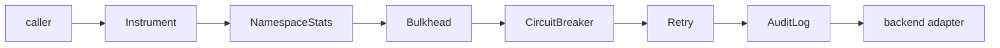

# Resilience & audit decorators

Each of these wraps a `Cache` and returns a `Cache`, so they compose by
stacking. A miss (`ErrNotFound`), an unsupported optional op
(`ErrUnsupported`), and `ErrCircuitOpen` are treated as normal outcomes, **not**
backend failures — they never trip a breaker or trigger a retry.

```go
import (
	"context"
	"log"
	"time"

	"github.com/ubgo/cache"
	mem "github.com/ubgo/cache-mem"
)
```

---

## Circuit breaker

### `NewCircuitBreaker(c Cache, opts ...BreakerOption) Cache`

One-line: after N consecutive real failures the circuit opens and ops fail fast
with `ErrCircuitOpen` until a cooldown elapses; then one half-open trial
request decides whether to close again. A success resets the failure count.

Use cases: stop hammering a sick Redis and amplifying an outage; shed load fast
so callers can fall back to a degraded path immediately.

### `WithBreakerThreshold(n int) BreakerOption`

Consecutive failures before the circuit opens (default 5).

### `WithBreakerCooldown(d time.Duration) BreakerOption`

How long the circuit stays open before a trial request is allowed (default
5s).

```go
c := cache.NewCircuitBreaker(mem.New(),
	cache.WithBreakerThreshold(10),
	cache.WithBreakerCooldown(2*time.Second),
)
if _, err := c.Get(context.Background(), "k"); errors.Is(err, cache.ErrCircuitOpen) {
	// backend is sick — serve a default / skip cache
}
```

---

## Retry with backoff

### `NewRetry(c Cache, opts ...RetryOption) Cache`

One-line: retries transient backend errors with exponential backoff;
`ErrNotFound`/`ErrUnsupported` return immediately (not transient); context
cancellation aborts the loop.

Use cases: ride out a brief network blip or a failover without surfacing the
error to the caller.

### `WithRetryAttempts(n int) RetryOption`

Maximum total attempts (default 3; values < 1 are clamped to 1).

### `WithRetryBackoff(base time.Duration) RetryOption`

Base delay; attempt *i* waits `base * 2^(i-1)`.

```go
c := cache.NewRetry(mem.New(),
	cache.WithRetryAttempts(4),
	cache.WithRetryBackoff(20*time.Millisecond), // waits 20ms, 40ms, 80ms
)
```

---

## Bulkhead

### `NewBulkhead(c Cache, maxConcurrent int) Cache`

One-line: caps in-flight operations at `maxConcurrent` so one overloaded
caller/namespace cannot exhaust backend connections and starve everyone else;
further ops block until a slot frees or their context is done (then
`ctx.Err()`, or `ErrTimeout` if the context carried no error).
`maxConcurrent < 1` is treated as 1.

Use cases: protect a small Redis connection pool; isolate a noisy tenant;
back-pressure instead of unbounded goroutine growth against a slow backend.

```go
c := cache.NewBulkhead(mem.New(), 64) // at most 64 concurrent cache ops
ctx, cancel := context.WithTimeout(context.Background(), 200*time.Millisecond)
defer cancel()
if _, err := c.Get(ctx, "k"); errors.Is(err, cache.ErrTimeout) {
	// couldn't get a slot in time — degrade
}
```

---

## Audit log

### `AuditEvent`

```go
type AuditEvent struct {
	Op   string    // "set","setmulti","setnx","expire","touch","incr","decr","del","deletebyprefix","flush"
	Keys []string  // affected key(s); prefix for deletebyprefix; nil for flush
	Err  error
	At   time.Time
}
```

Audit logs intentionally include **raw keys** — route them to a trusted sink.

### `AuditFunc`

`type AuditFunc func(AuditEvent)` — receives every state-changing event. It
**must not block** (it runs inline on the mutation path).

### `NewAuditLog(c Cache, fn AuditFunc) Cache`

One-line: wraps `c` so every mutation emits an `AuditEvent` — a compliance
trail of what was written or purged and when. Reads are not audited.

Use cases: SOC2/PCI "who purged the cache" trail; debugging unexpected
invalidations; security forensics.

```go
c := cache.NewAuditLog(mem.New(), func(ev cache.AuditEvent) {
	auditSink.Write(ev.At, ev.Op, ev.Keys, ev.Err) // non-blocking sink
})
_ = c.Flush(context.Background()) // emits {Op:"flush", Keys:nil}
```

---

## Decorator stacking order

Decorators compose outermost-first. A sensible production stack, from the
caller down to the backend:



Rationale: observe what the caller actually experienced (outermost); bound
concurrency before the breaker so a flood doesn't all pile onto the trial
request; retry *inside* the breaker so retries count toward the failure
threshold; audit the real mutations that reach the backend.

```go
backend := mem.New()
c := cache.Instrument(
	cache.NewNamespaceStats(
		cache.NewBulkhead(
			cache.NewCircuitBreaker(
				cache.NewRetry(
					cache.NewAuditLog(backend, auditFn),
					cache.WithRetryAttempts(3),
				),
				cache.WithBreakerThreshold(5),
			),
			64,
		),
		nil,
	),
	cache.ObsHooks{Adapter: "mem"},
)
_ = c
```

Adjust the order to your needs — e.g. put `Retry` outside the breaker if you
want retries to *not* count against the threshold.
